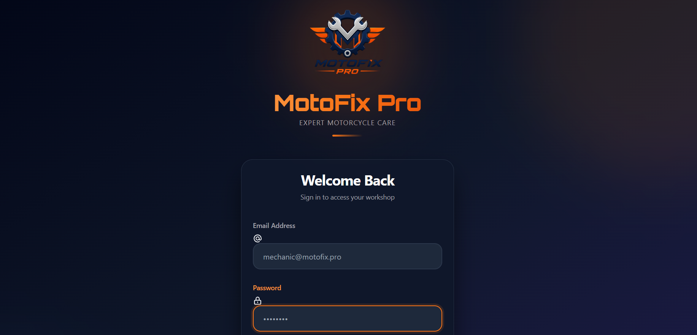
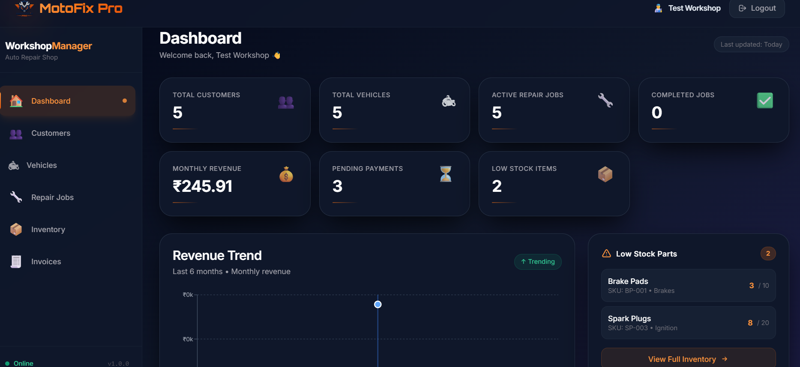
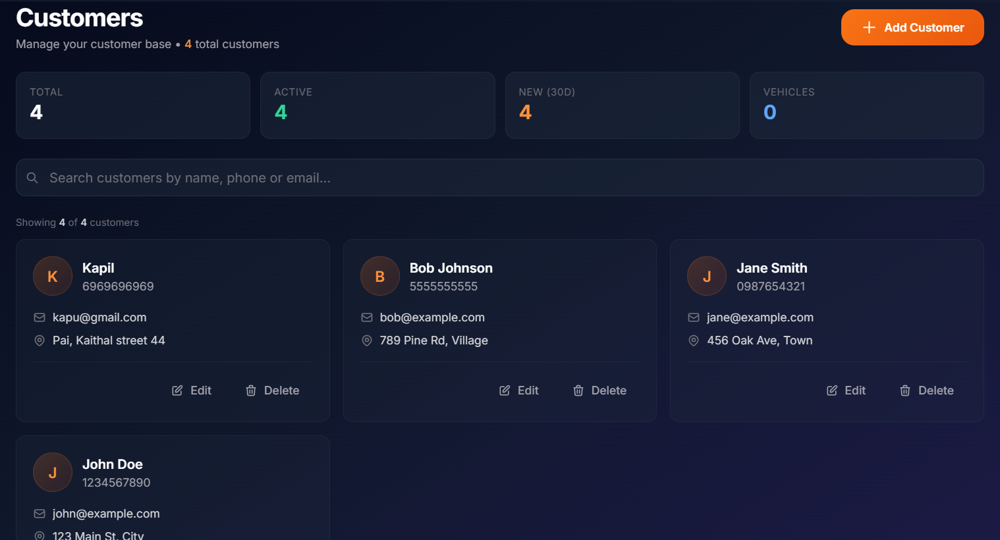
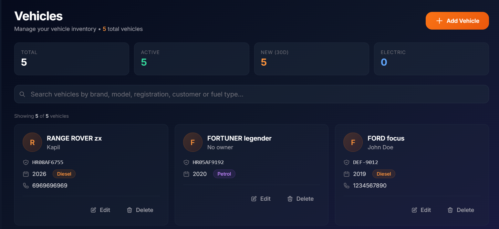
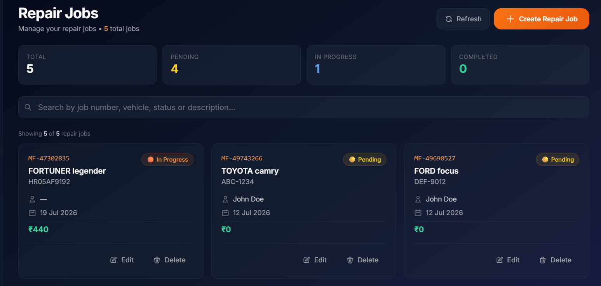
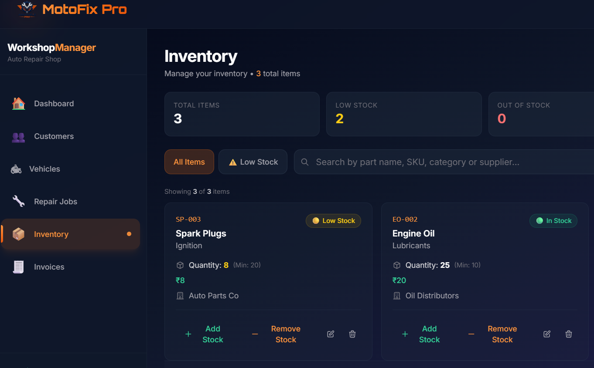
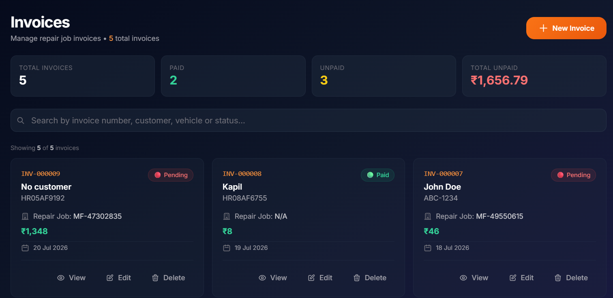

# 🚗 MotoFix Pro


MotoFix Pro is a **full-stack Garage Management System** built with the **MERN Stack**. It helps mechanics and garage owners efficiently manage customers, vehicles, repair jobs, inventory, invoices, and business analytics through a modern and responsive web application.

> **Current Status:** ✅ Full-Stack Application Completed

---

# ✨ Features

## 🔐 Authentication

- User Registration
- Secure Login
- JWT Authentication
- HttpOnly Cookie Authentication
- Protected Routes
- Password Hashing (bcrypt)
- User Profile
- Logout

---

## 👥 Customer Management

- Add Customers
- View Customer List
- Search Customers
- Update Customer Information
- Delete Customers
- User-specific Data Isolation

---

## 🚗 Vehicle Management

- Register Vehicles
- Customer-Vehicle Relationship
- View Vehicle Details
- Update Vehicle Information
- Delete Vehicles
- Search & Pagination

---

## 🔧 Repair Job Management

- Create Repair Jobs
- Assign Customer & Vehicle
- Diagnostic Notes
- Repair Status Tracking
- Labor Cost
- Parts Cost
- Estimated Delivery Date
- Payment Tracking
- Balance Due Calculation

---

## 📦 Inventory Management

- Add Spare Parts
- Update Inventory
- Delete Inventory Items
- Increase/Decrease Stock
- Low Stock Alerts
- Search Inventory
- Filter by Category
- Pagination
- Automatic Stock Adjustment

---

## 🧾 Invoice Management

- Create Invoices
- Automatic Invoice Number Generation
- One Invoice per Repair Job
- Automatic Total Calculation
- Tax & Discount Support
- Payment Status
- Payment Method
- Inventory Price Lookup
- Invoice Editing
- Invoice Deletion

---

## 📊 Dashboard Analytics

- Total Customers
- Total Vehicles
- Total Repair Jobs
- Inventory Count
- Low Stock Items
- Pending Payments
- Monthly Revenue
- Business Overview Cards

---

# 🛠 Tech Stack

## Frontend

- React 19
- Vite
- React Router DOM
- Axios
- Tailwind CSS
- Context API

## Backend

- Node.js
- Express.js
- MongoDB
- Mongoose

## Authentication

- JWT
- bcrypt
- HttpOnly Cookies

## Tools

- Git
- GitHub
- VS Code
- Postman
- npm

---

# 📁 Project Structure

```text
MotoFix-Pro/
│
├── backend/
│   ├── src/
│   │   ├── controllers/
│   │   ├── middlewares/
│   │   ├── models/
│   │   ├── routes/
│   │   ├── services/
│   │   ├── utils/
│   │   ├── db/
│   │   └── app.js
│   │
│   ├── server.js
│   ├── package.json
│   └── .env
│
├── frontend/
│   ├── src/
│   │   ├── components/
│   │   ├── pages/
│   │   ├── services/
│   │   ├── hooks/
│   │   ├── context/
│   │   ├── layouts/
│   │   └── App.jsx
│   │
│   ├── package.json
│   └── vite.config.js
│
├── .gitignore
└── README.md
```

---

# ⚙️ Installation

## Clone Repository

```bash
git clone https://github.com/jagdeepsheokand/motofix-pro.git
```

```bash
cd MotoFix-Pro
```

---

## Install Backend

```bash
cd backend
npm install
```

---

## Install Frontend

```bash
cd ../frontend
npm install
```

---

# 🔐 Environment Variables

Create a `.env` file inside the **backend** folder.

```env
PORT=3000

MONGO_URI=your_mongodb_connection_string

JWT_SECRET=your_secret_key
```

---

# ▶️ Running the Project

## Backend

```bash
cd backend
npm run dev
```

Runs on:

```
http://localhost:3000
```

---

## Frontend

```bash
cd frontend
npm run dev
```

Runs on:

```
http://localhost:5173
```

---

# 📈 Project Status

# 📸 Screenshots


### Login



### Dashboard



### Customers



### Vehicles



### Repair Jobs



### Inventory



### Invoices



---

# 🚀 Future Enhancements

- PDF invoice export
- Email notifications
- Role-based authentication
- Appointment scheduling

---


# 👨‍💻 Author

**Jagdeep Sheokand**

GitHub: https://github.com/jagdeepsheokand

---

# 🤝 Contributing

Contributions are welcome!

1. Fork the repository
2. Create a feature branch

```bash
git checkout -b feature/new-feature
```

3. Commit your changes

```bash
git commit -m "Add new feature"
```

4. Push your branch

```bash
git push origin feature/new-feature
```

5. Open a Pull Request

---

# 📄 License

This project is licensed under the **MIT License**.

---

⭐ If you found this project helpful, consider giving it a **Star** on GitHub!